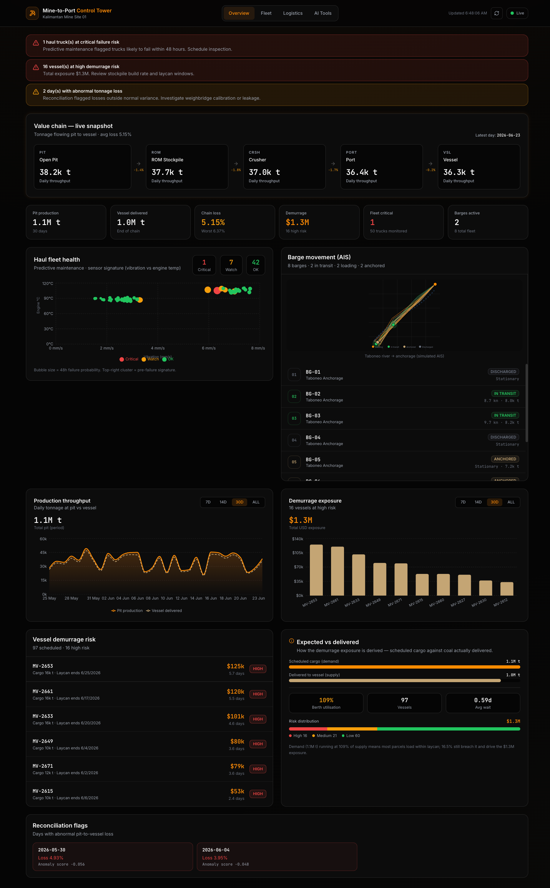
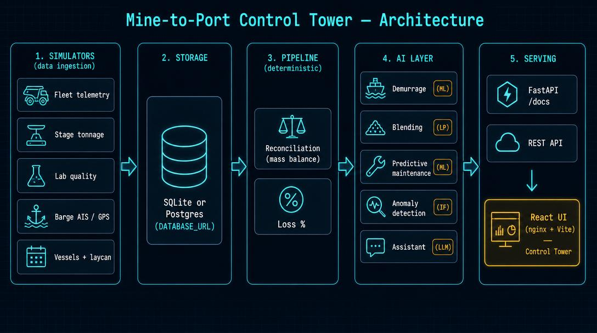

# Coal Mine-to-Port Control Tower (simulated)

An enterprise **Forward Deployed Engineer (FDE) portfolio project** modeled on a
real Indonesian coal value chain: `PIT → ROM → CRUSHER → PORT → VESSEL`.

It integrates a simulated mine-to-port operation into one data layer and applies
**AI surgically** to the three problems where uncertainty actually lives, plus an
LLM layer for natural-language access. Everything else is deterministic data
engineering, which is exactly the judgment an enterprise FDE is hired for.

> **The thesis to pitch:** *A control tower is ~70% integration & visibility. AI is
> the scalpel, not the hammer, applied to demurrage risk, quality blending, and
> equipment failure, each mapped to a specific dollar lever.*



---

## What it demonstrates

| Capability | Where | FDE signal |
|---|---|---|
| Multi-source **data integration** | `simulators/`, `db.py` | Fleet telemetry, weighbridge, lab assays, AIS, vessel schedules unified |
| **Tonnage reconciliation** | `pipeline/reconciliation.py` | Pit-to-vessel mass balance & loss tracking |
| **Demurrage prediction** (ML) | `ai/demurrage.py` | Forecast vessel waiting → **USD exposure** |
| **Blending optimization** (LP) | `ai/blending.py` | Meet contract spec at min cost, minimize quality giveaway |
| **Predictive maintenance** (ML) | `ai/predictive_maintenance.py` | Flag haul trucks likely to fail in 48h |
| **Anomaly detection** | `ai/reconciliation_anomaly.py` | Separate normal loss from drift/theft |
| **LLM ops assistant** | `ai/assistant.py` | Ask in English / Bahasa Indonesia (tool-calling + fallback) |
| **API + frontend** | `api/`, `frontend/` | FastAPI service + React control-tower UI (dark terminal aesthetic) |

### Where AI helps the business (and where it deliberately doesn't)

- **AI (uncertainty / prediction):** demurrage risk, fleet failure, anomaly detection.
- **OR / LP (hard constraints):** blending to spec, not ML on purpose.
- **Plain data engineering (no AI):** integration, KPIs, tonnage sums, threshold alerts.

---

## Data sources: what feeds the tower

A real mine-to-port operation has data scattered across OEM portals, spreadsheets,
LIMS, the weighbridge PLC, and a marine-traffic feed. The tower unifies five
streams into one schema (`db.py`); the simulators (`simulators/`) stand in for the
live connectors you'd swap in for production.

| Stream | Real-world source | Table | Used for |
|---|---|---|---|
| **Equipment sensors** (telematics) | Haul-truck OEM telematics (engine temp, oil pressure, vibration, payload, fuel rate, cycle time) | `fleet_telemetry` | Predictive maintenance (the pre-failure signature) |
| **GPS / AIS positions** | Barge transponders broadcasting lat/lon/speed/heading (marine AIS feed) | `barge_position` | Live barge tracking, ETA & berth congestion on the map |
| **Weighbridge** | Pit/ROM/crusher/port scale readings | `stage_tonnage` | Tonnage reconciliation & mass balance |
| **Lab assays** | LIMS quality results (CV, ash, sulphur, TM) | `lab_quality` | Blending optimization to contract spec |
| **Vessel nominations** | Charter party / laycan schedule + day-rate | `vessel` | Demurrage prediction & USD exposure |

- **Sensor data** drives the **Fleet Health** panel; the model reads the telematics
  channels and converts them to `OK / WATCH / CRITICAL` health states.
- **GPS/AIS data** drives the **Barge Movement** panel; the SVG map and trails are
  rendered from `barge_position` (and `/barge/tracks`), giving live `loading →
  in-transit → anchored → discharged` status.

### Real hardware & feeds you'd connect (what produces this data)

The simulators stand in for these. In production you'd swap each one for the
vendor's API / data export, with no schema change.

| Data | Real product(s) that emit it | How you'd ingest |
|---|---|---|
| **Truck telematics** (engine temp, oil pressure, vibration, fuel, cycle time) | **Cat MineStar Health / Product Link** + onboard **VIMS**; **Komatsu KOMTRAX / VHMS**; **Hitachi ConSite + Wenco**; **Volvo CareTrack** | OEM telematics API / AEMP ISO 15143-3 feed |
| **Add-on condition monitoring** (vibration / temp on pumps & drivetrains) | **SKF Enlight**, **Emerson AMS**, **Banner**, **Fluke** wireless sensors | MQTT / OPC-UA → historian |
| **Payload / onboard scale** | **Loadrite**, **VEI**, **RDS**, OEM payload (Cat PMS) | Scale controller export |
| **Tyre pressure/temp (TPMS)** | **Bridgestone iTrack**, **Michelin MEMS** | Vendor API |
| **High-precision truck GPS** (positioning / fleet dispatch) | **Hexagon Mining (Leica Jigsaw)**, **Trimble**, **Topcon**, **Modular Mining DISPATCH** | GNSS + fleet-mgmt API |
| **Barge / vessel AIS** (lat/lon/speed/heading) | Transponders: **Saab R5**, **Furuno FA-170**, **em-trak**, **SRT Marine**; aggregated feeds: **MarineTraffic**, **Spire Maritime**, **exactEarth**, **ORBCOMM** | AIS NMEA stream / provider REST/WebSocket |
| **Barge IoT GPS** (non-SOLAS barges, satellite) | **ORBCOMM**, **Globalstar**, **Iridium** asset trackers | Satellite IoT API |
| **Weighbridge** | **Avery Weigh-Tronix**, **METTLER TOLEDO**, **Schenck** truck scales | PLC / weighbridge software DB |
| **Lab assays** (CV/ash/sulphur/TM) | LIMS: **Thermo SampleManager**, **LabWare**; bomb calorimeters, proximate analysers | LIMS export / DB |
| **Vessel nominations / laycan** | Charterer/agent **charter party** docs, shipping ERP | EDI / spreadsheet / ERP API |

---

## Business process: problem, solution, result

Every lever maps to a specific dollar leak. Figures below are **modeled from the
30-day simulation** (`SIM_SEED`-reproducible) and stated assumptions; they show
*how the impact is quantified*, not audited savings from a live site.

### Baseline the tower measures (current 30-day run)

| Metric | Value |
|---|---|
| Vessels scheduled | 97 |
| Pit tons → vessel tons | 1,080,769 t → 1,024,819 t |
| Avg pit-to-vessel loss | **5.15%** (worst day 6.37%) |
| Berth utilisation | **109%** (over-subscribed → demurrage pressure) |
| Demurrage exposure (30 d) | **$1.25M** (avg 0.59 days/vessel) |
| Risk mix | 16 high · 21 medium · 60 low |
| Fleet health (50 trucks) | 1 CRITICAL · 7 WATCH · 42 OK |

### 1. Demurrage: stop paying ships to wait

- **Problem:** berth is 109% subscribed; vessels wait on anchor and the charter
  clock runs at **$22,000/day**. Exposure is invisible until the invoice arrives.
- **Solution:** predict demurrage days per vessel from operational drivers and
  surface a ranked risk list early enough to re-sequence loading.
- **Result:** model **MAE ≈ 0.42 days** (~10 h; ±~$9.3k/vessel), **R² 0.69** out-of-fold.
  16 of 97 vessels (16.5%) flagged high-risk **before** laycan breach. The board
  quantifies **$1.25M / month** of exposure that was previously unmeasured;
  recovering even 25% via re-sequencing ≈ **~$310k/month (~$3.7M/yr)**.

### 2. Blending: stop giving quality away for free

- **Problem:** to be safe, ops over-deliver calorific value above the contract
  spec, the "quality giveaway" handed to the buyer at no extra price.
- **Solution:** an LP chooses tons per stockpile to **just meet** CV/ash/sulphur/TM
  at minimum cost.
- **Result:** for a 65,000 t cargo the optimizer holds blend cost to **$31.43/ton**
  and exposes **24.4 CV of giveaway ≈ $19,636 per cargo** (~$0.30/ton). Applied
  across ~1.02M t/month that's **~$300k/month (~$3.6M/yr)** of recoverable margin
  made visible.

### 3. Predictive maintenance: convert unplanned to planned downtime

- **Problem:** a haul truck failing mid-cycle on the ramp stalls the whole chain;
  unplanned downtime costs far more than scheduled service.
- **Solution:** classify the pre-failure sensor signature (engine temp, vibration,
  oil pressure) to flag trucks likely to fail within 48h.
- **Result:** **ROC-AUC 0.91**. From the current fleet, 1 CRITICAL + 7 WATCH trucks
  are surfaced for the maintenance window before they break, shifting downtime
  from reactive to planned and protecting daily build rate.

### 4. Reconciliation anomaly: separate normal loss from drift/theft

- **Problem:** ~5% mass is lost pit-to-vessel; some is real (moisture/measurement),
  some is scale drift or theft, and it all looks the same in a spreadsheet.
- **Solution:** `IsolationForest` flags days whose stage-to-stage loss deviates
  from the normal envelope.
- **Result:** **2 of 30 days** flagged for investigation. Recovering just 0.5 pp of
  the 5.15% loss on 1.08M t ≈ **5,400 t/month ≈ ~$280k/month (~$3.4M/yr)** at the
  reference price, focused on the right days instead of auditing all 30.

> **Headline:** the four levers expose on the order of **$1M+/month** of leakage
> and recoverable margin that lived in disconnected systems before integration,
> the FDE value is making it *one number on one screen, with the action attached*.

---

## The AI components in business terms

1. **Demurrage prediction** (`RandomForestRegressor`, out-of-fold CV)
   Predicts demurrage *days* per vessel from operational drivers (build rate, rain,
   port congestion, quality margin) → multiplies by the demurrage day-rate to give
   **USD exposure**. Reported with MAE (days) since the target is zero-heavy.
   *Cleanest dollar story:* demurrage is pure cash leakage.

2. **Blending optimization** (`PuLP` linear program)
   Chooses tons from each stockpile to **just meet** the contract spec (CV/ash/
   sulphur/TM) at minimum cost, quantifying "quality giveaway" you'd otherwise hand
   to the buyer for free. *Biggest margin lever.*

3. **Predictive maintenance** (`RandomForestClassifier`)
   Learns the pre-failure sensor signature (engine temp, vibration, oil pressure)
   to flag trucks likely to fail within 48h → shift unplanned to planned downtime.

4. **Reconciliation anomaly detection** (`IsolationForest`)
   Flags days whose stage-to-stage loss is abnormal (calibration drift / theft)
   versus normal moisture/measurement variance.

5. **LLM ops assistant** (OpenAI function-calling, with rule-based fallback)
   Natural-language access to every analytic above. Works with no API key via a
   deterministic keyword router so the demo never breaks.

---

## Architecture




| Layer | What it does | Tech |
|---|---|---|
| **Simulators** | Stand in for live connectors; emit reproducible data | `simulators/` |
| **Storage** | Single unified schema | SQLite default · Postgres via `DATABASE_URL` |
| **Pipeline** | Deterministic reconciliation & KPIs | `pipeline/` |
| **AI layer** | Demurrage, blending, PdM, anomaly, assistant | scikit-learn · PuLP · LLM |
| **Serving** | REST API + control-tower UI | FastAPI · React/Vite (nginx) |

- **Reproducible:** all randomness derives from `SIM_SEED`: same seed, same numbers.
- **Deployment-ready:** switch storage to Postgres with one env var, no code change.

---

## Quickstart

```bash
make install           # uv sync (Python backend)
make frontend-install  # npm install (React UI)
make seed              # simulate 30 days of mine-to-port data into SQLite
make train             # train demurrage, predictive-maintenance, anomaly models
make api               # FastAPI backend → http://localhost:8000/docs
make frontend          # React UI (dev)  → http://localhost:5173
```

Or one-shot setup:

```bash
make all   # install + frontend-install + seed + train
make api & make frontend
```

Docker (self-contained):

```bash
make docker-build && make docker-up
# API:       http://localhost:8000
# Frontend: http://localhost:3000
```

One-shot end-to-end check:

```bash
make smoke
```

---

## Configuration

Copy `.env.example` to `.env`. Key settings:

- `OPENAI_API_KEY`: enables the LLM assistant (optional).
- `DATABASE_URL`: SQLite (default) or Postgres.
- `SIM_SEED`, `SIM_DAYS`, `SIM_TRUCKS`: simulation controls.

---

## Disclaimer

All data is **synthetically generated** for demonstration. Quality profiles,
demurrage rates, and value-chain stages are realistic but illustrative, not tied
to any specific company. Swap the simulators for real connectors (OEM telematics,
LIMS, weighbridge, AIS, vessel nominations) to deploy against live systems.
